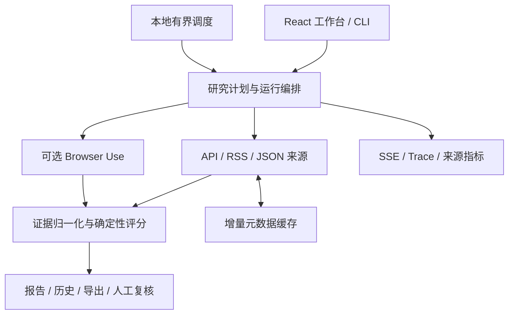

# Signal Radar

**面向 AI 开源项目的证据驱动情报工作台。**

[](https://github.com/RubiumOnly/ai-open-source-signal-radar/actions/workflows/ci.yml)
[](pyproject.toml)
[](frontend/package.json)
[](LICENSE)

[快速开始](#快速开始) · [使用指南](docs/USAGE.md) · [API 参考](docs/API.md) · [评测](docs/EVALUATION.md) · [更新记录](CHANGELOG.md)

Signal Radar 汇总 GitHub 版本与开发者反馈、公开技术文章及社区讨论，整理为带原文摘录、来源链接、访问状态和运行轨迹的研究报告。你可以确认采集计划、追查问题、回放历史、复核证据，也可以启动有界的本地定时监控。

项目面向本地或受控的单用户环境。GitHub 反馈不等于大众舆情，来源覆盖不等于全网搜索；未采集到的正文不会被补写成事实。

## 工作台预览


*当前前端加载 Replay 固定样例的实际浏览器截图，不代表实时采集结果。*

## 核心能力

| 能力 | 当前实现 |
| --- | --- |
| 研究计划 | 规则解析项目、时间窗口、关注主题和来源，采集前确认范围 |
| 多源采集 | 结构化 API、RSS/JSON 优先，Browser Use 作为可选动态页面路径 |
| 证据报告 | 保存链接、摘录、时间、哈希和证据等级，展示事件、主题与风险信号 |
| 可观测运行 | 有界并行、预算、协作式取消、部分成功、结构化 SSE 与 Trace 回放 |
| 增量研究 | 有界分页、条件请求和记录指纹，保留缓存命中及新增/重复指标 |
| 归档与复核 | SQLite 历史、Markdown/JSON 导出、证据标注与标注集导出 |
| 定时监控 | 显式启动、限定间隔与次数、状态查询和停止，每次运行写入历史 |

### 数据来源

| 来源 | 采集范围 | 访问条件 |
| --- | --- | --- |
| GitHub | Releases、Issues；按需 PR、Discussions、PR review comments | 公开 API，Token 可提高配额 |
| RSS / Atom | 官方博客、更新日志、技术文章 | 配置可访问的 feed |
| Hacker News | Algolia 索引中的公开帖子与评论 | 公共 API |
| Reddit | 公开帖子及可用内容 | 公共 JSON，可能受限流或访问策略影响 |
| Stack Exchange | 按需查询 Stack Overflow 等站点的技术问答 | 公共 API，有配额与 backoff |
| Browser Use | 用户指定的动态页面，或显式授权后的本地会话 | 可选依赖、模型 Key、双开关和域名白名单 |

来源不可访问、需要授权或仅有元数据时会保留显式状态。具体来源参数见[使用指南](docs/USAGE.md#选择数据来源)。

## 快速开始

先体验 **Replay**：运行不需要模型 Key，也不会发起外部采集。安装依赖时仍需要网络。

### 环境要求

- Python 3.11+，推荐 3.12。
- Node.js 22 与 npm，用于构建 React 工作台。
- Git，以及可写的本地项目目录。

### 1. 安装后端

```powershell
git clone https://github.com/RubiumOnly/ai-open-source-signal-radar.git
cd ai-open-source-signal-radar
python -m venv .venv
.\.venv\Scripts\Activate.ps1
python -m pip install -e ".[dev,api]"
```

<details>
<summary>macOS / Linux 的虚拟环境激活方式</summary>

```bash
source .venv/bin/activate
python -m pip install -e ".[dev,api]"
```

克隆仓库和创建虚拟环境的命令与上面相同；后续命令均在已激活的虚拟环境中执行。

</details>

### 2. 构建工作台

```sh
npm --prefix frontend ci
npm --prefix frontend run build
```

### 3. 启动并体验

```sh
python -m uvicorn signal_radar.api:app --host 127.0.0.1 --port 8000
```

打开 [http://localhost:8000](http://localhost:8000)。首页会加载固定 Replay 报告；输入研究问题、点击“解析计划”，确认来源后以 **Replay** 模式“开始研究”，即可生成一条可回放的历史运行。

```text
分析 browser-use/browser-use 最近 30 天的版本变化、安装兼容性和社区反馈
```

持久化运行支持 Markdown/JSON 报告导出；首屏 Replay 预览支持 JSON 快照。API 交互文档位于 [http://localhost:8000/docs](http://localhost:8000/docs)。

### 开发模式与 CLI

修改前端时，保留上面的 API 服务，在另一个终端运行：

```sh
npm --prefix frontend run dev
```

打开 [http://localhost:4174](http://localhost:4174)。Vite 将 `/api` 请求代理到 `127.0.0.1:8000`；前端构建产物不会自动随源码更新。

只体验命令行 Replay，无需启动 Web 服务：

```sh
python -m signal_radar --mode replay --fixture fixtures/demo_report.json
```

Docker 配置、旧版静态回退入口和故障排查见[使用指南](docs/USAGE.md)。已有 `.env` 时，服务会加载其中的配置；快速体验不要求创建或填写密钥文件。

## 启用 Live

公开 API 来源与 Browser Use 的前提不同：**GitHub、RSS 等结构化来源不需要模型 Key**；动态浏览器路径才需要模型配置。

公开 GitHub 来源示例：

```sh
python -m signal_radar --mode live --project browser-use/browser-use --source github --days 30 --limit 20
```

需要动态网页时，先安装可选依赖：

```sh
python -m pip install -e ".[api,live]"
```

以 [.env.example](.env.example) 为配置模板，在未提交的本地 `.env` 中填写模型参数，并显式设置：

```dotenv
MODEL_PROVIDER=deepseek
DEEPSEEK_API_KEY=your-key
SIGNAL_RADAR_BROWSER_ENABLED=true
SIGNAL_RADAR_BROWSER_RUN_LIVE=true
SIGNAL_RADAR_BROWSER_ALLOWED_DOMAINS=github.com
ANONYMIZED_TELEMETRY=false
```

重启 API 后，再切换工作台到 **Live**。运行可能产生第三方 API/模型费用；网页授权、Chromium 环境、其他来源及预算参数见 [Live 配置](docs/USAGE.md#browser-use-动态网页)。密钥不要放入前端、URL、截图或 Git。

## 架构



- **前端**：React 18、TypeScript、Vite、CSS design tokens、Lucide。
- **API 与契约**：FastAPI、Pydantic 2、REST 与 SSE。
- **采集与模型**：确定性来源适配器优先；Browser Use 动态抽取可使用 DeepSeek 等模型配置。
- **存储与验证**：SQLite、pytest/unittest、离线 fixture 与 GitHub Actions。

## 边界与限制

- 研究计划采用规则解析，聚合和风险评分主要采用确定性规则；不是无限制联网聊天，也不是已验证的通用 Deep Research 引擎。
- 证据可信度与风险分数是分析信号，不等于事实准确率。真实网页与模型链路的可靠性不能仅由离线测试推断。
- Browser Use 默认关闭；登录态需本地显式授权。不绕过验证码、付费墙或访问控制，网页文本不能作为任务指令。
- 调度计划保存在进程内，服务重启后不会自动恢复；SQLite 与单 Bearer Token 不提供多租户隔离。
- 默认部分只读观测接口公开。共享部署需要 Token、HTTPS、网络隔离与额外访问控制；个人浏览器 Profile 不应挂载到公共服务。

完整说明见 [SECURITY.md](SECURITY.md) 与 [API 认证边界](docs/API.md#认证)。

## 测试与文档

基础测试无需安装 Browser Use Live 依赖，也不调用真实模型或外部来源：

```sh
python -m pytest -q
python -m unittest discover -s tests -q
python -m compileall -q signal_radar tests
npm --prefix frontend run build
```

| 文档 | 内容 |
| --- | --- |
| [使用指南](docs/USAGE.md) | 来源、缓存、Browser Use、定时监控、部署与故障排查 |
| [API 参考](docs/API.md) | 端点、认证、运行与报告契约、复核示例 |
| [离线评测](docs/EVALUATION.md) | 评测命令、基准、安全门禁及解释范围 |
| [配置模板](.env.example) | 模型、来源、预算、存储与认证环境变量 |
| [贡献指南](CONTRIBUTING.md) | 开发验证与数据源约定 |
| [更新记录](CHANGELOG.md) | 功能与修复历史 |

## 贡献与许可证

欢迎通过 [Issues](https://github.com/RubiumOnly/ai-open-source-signal-radar/issues) 提交可复现问题或来源适配建议；提交代码前请阅读[贡献指南](CONTRIBUTING.md)。安全问题按[安全说明](SECURITY.md)私下报告，不要公开凭据或可利用细节。

本项目采用 [MIT License](LICENSE)。浏览器 Agent 依赖 [browser-use](https://github.com/browser-use/browser-use)，第三方依赖与数据来源仍受各自许可证和服务条款约束。
