# Signal Radar

<p align="center"><strong>面向 AI 开源项目的证据驱动情报工作台</strong></p>

<p align="center">
  <a href="https://github.com/RubiumOnly/ai-open-source-signal-radar/actions/workflows/ci.yml"></a>
  <a href="https://www.python.org/"></a>
  <a href="https://fastapi.tiangolo.com/"></a>
  <a href="https://docs.pydantic.dev/"></a>
  <a href="https://react.dev/"></a>
  <a href="https://www.typescriptlang.org/"></a>
  <a href="https://vite.dev/"></a>
  <a href="https://www.sqlite.org/"></a>
  <a href="https://developer.mozilla.org/en-US/docs/Web/API/Server-sent_events"></a>
  <a href="https://github.com/browser-use/browser-use"></a>
  <a href="https://www.docker.com/"></a>
  <a href="LICENSE"></a>
</p>

[快速开始](#快速开始) · [工作台截图](#工作台截图) · [使用指南](docs/USAGE.md) · [API 参考](docs/API.md) · [评测](docs/EVALUATION.md) · [更新记录](CHANGELOG.md)

Signal Radar 汇总 GitHub 版本与开发者反馈、公开技术文章及社区讨论，整理为带原文摘录、来源链接、访问状态和运行轨迹的研究报告。你可以确认采集计划、追查问题、回放历史、复核证据，也可以启动有界的本地定时监控。

项目面向本地或受控的单用户环境。GitHub 反馈不等于大众舆情，来源覆盖不等于全网搜索；未采集到的正文不会被补写成事实。

## 真实 Live 运行

下面的截图来自 **2026-10-01 的真实 Live 运行**，不是 fixture 或静态演示：

- 运行 ID：`run-96052cbeb825`
- 运行方式：结构化 API + Browser Use 只读动态页面；按用户要求跳过 Reddit
- 项目：`browser-use/browser-use`
- 时间窗口：365 天
- 结果：480 条证据、480 个事件、8 个已请求来源、100% 来源覆盖
- 证据等级：435 条完整正文/摘录、45 条仅元数据；480 条新增、0 条重复
- 采集质量：13 页；结构化来源单项平均延迟约 1797 ms；Browser Use 处理 4 个动态页面，来源耗时约 103083 ms

| 来源 | 记录 | 页数 | 延迟 | 增量结果 |
| --- | ---: | ---: | ---: | --- |
| Browser Use 动态页面 | 55（10 条原文摘录） | 4 | 103083 ms | 55 条新增，45 条元数据记录 |
| GitHub Releases / Issues | 64 | 2 | 2817 ms | 64 条新增 |
| GitHub Pull Requests | 100 | 1 | 2345 ms | 100 条新增 |
| GitHub PR review comments | 100 | 1 | 1648 ms | 100 条新增 |
| GitHub Discussions | 31 | 1 | 1767 ms | 31 条新增 |
| Hacker News | 0 | 1 | 711 ms | 查询成功，时间窗口内无命中 |
| RSS / Atom | 30 | 2 | 2126 ms | 2 个已配置 Feed，30 条新增 |
| Stack Overflow | 100 | 1 | 1163 ms | 100 条新增 |

本轮 RSS/Atom 实际读取了 [browser-use Releases Atom](https://github.com/browser-use/browser-use/releases.atom) 和 [main 分支提交 Atom](https://github.com/browser-use/browser-use/commits/main.atom)，共采集 30 条。Browser Use 对 Issues、Pull Requests、Discussions 和 Releases 四个公开页面分别运行受限只读任务，合计返回 55 条；其中 10 条带有原文摘录，其余 45 条仅有页面元数据，因此不会伪装成正文证据。Hacker News 查询成功但没有命中。Reddit 按本轮明确要求未请求；其余 8 个已请求来源均完成，覆盖率为 100%。

结构化 API/RSS 来源单项延迟均值约 1797 ms；Browser Use 单独报告四个动态页面任务的来源耗时，不与 API 请求耗时混算。结构化来源不需要模型 Key，Browser Use 才调用配置的 DeepSeek 模型。

## 工作台截图

README 中的截图按一次真实 Live 研究的生命周期组织，覆盖“提出问题 → 确认来源 → 采集 → 分析 → 复核 → 归档 → 监控”七个阶段。除特别说明外，截图均来自本地工作台对 `browser-use/browser-use` 的真实报告；截图中的敏感配置字段保持为空，密钥不会进入图片。

### 1. 提出问题与确认计划

输入自然语言研究问题后，先点击“解析计划”。解析阶段不会访问网络，会展示识别出的项目、时间窗口、研究主题、来源开关、调研深度和“开始研究”确认入口；用户可以在联网前关闭某个来源或补充 RSS、社区查询词和 Browser Use 页面 URL。

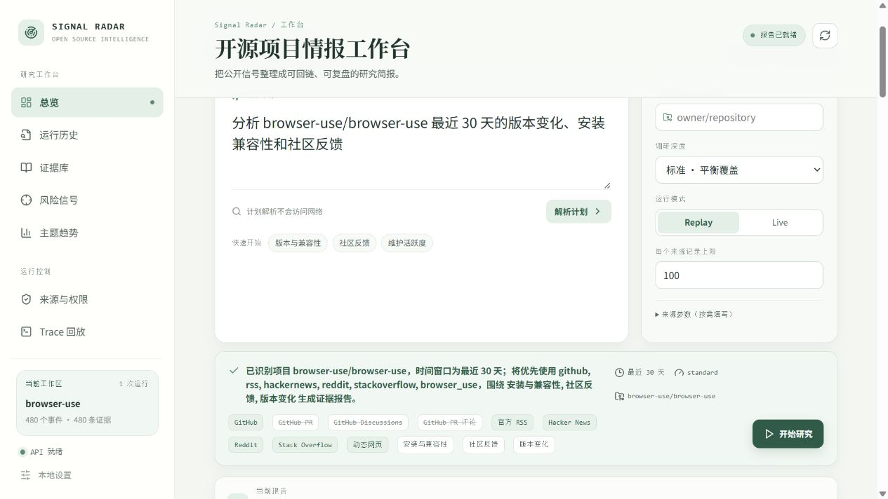

### 2. 采集与来源可观测性

确认计划后，工作台以结构化事件、来源状态、记录数量、页数、延迟、缓存命中和访问边界展示采集过程。本轮运行同时展示 Browser Use、GitHub、GitHub Discussions、Pull Requests、PR review comments、Hacker News、RSS/Atom 和 Stack Overflow 的来源结果。

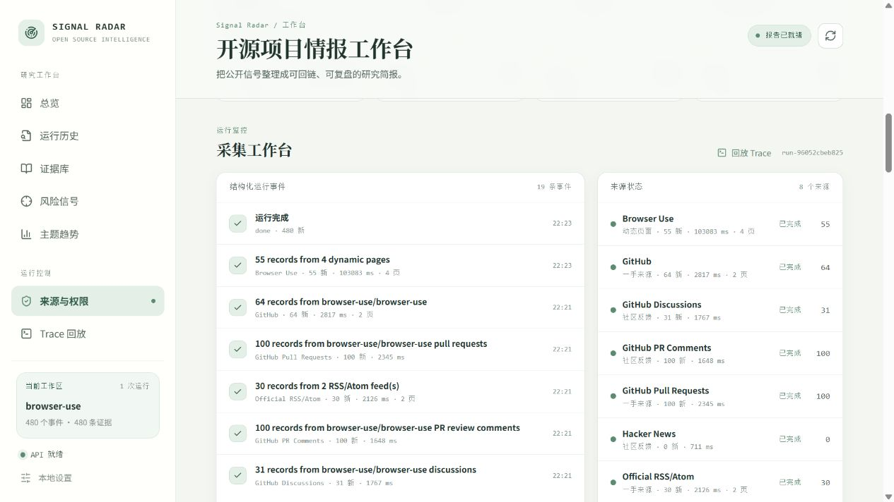

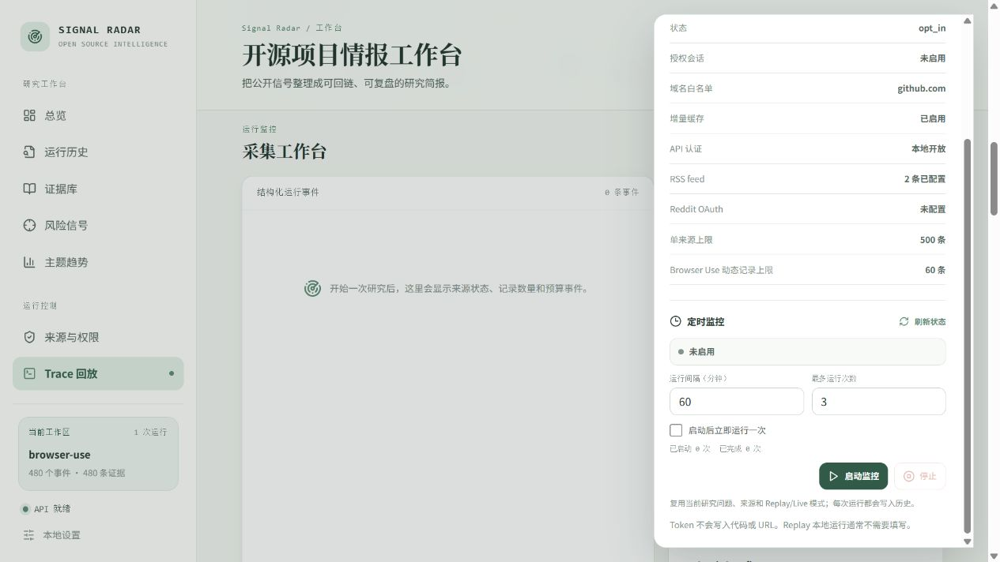

### 3. 风险信号与趋势分析

报告生成后，系统将证据聚合为风险信号、主题分布和时间趋势。风险卡片提供风险等级、立场和证据数量；主题趋势同时保留不同来源的主题规模和日期维度，方便区分单条异常与持续性变化。

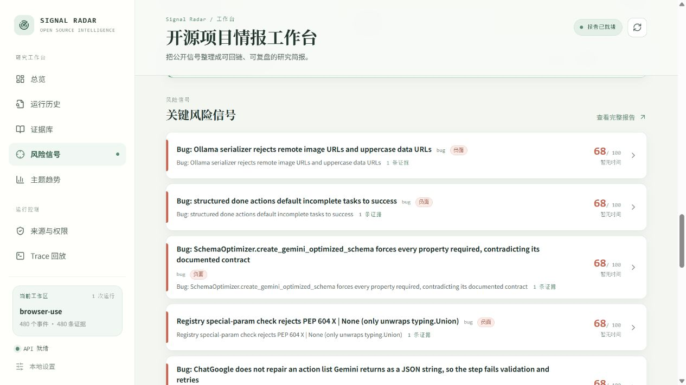

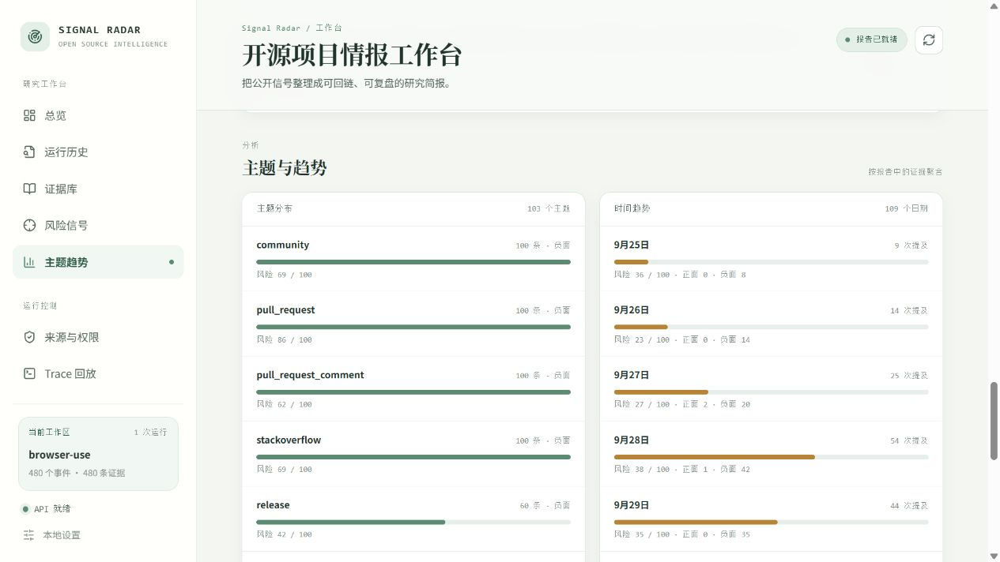

### 4. 证据回链与人工复核

证据库保留原文链接、摘录、证据等级和元数据降级状态。点击“标注”后，可以分别记录正确性、风险等级或立场，并填写复核者和备注；标注写入独立的本地 SQLite 表，不改写原始报告。报告还支持 JSON、Markdown 和标注集导出。

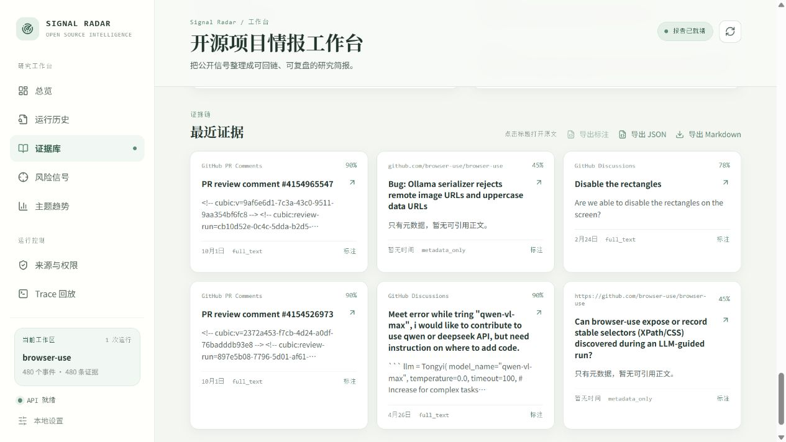

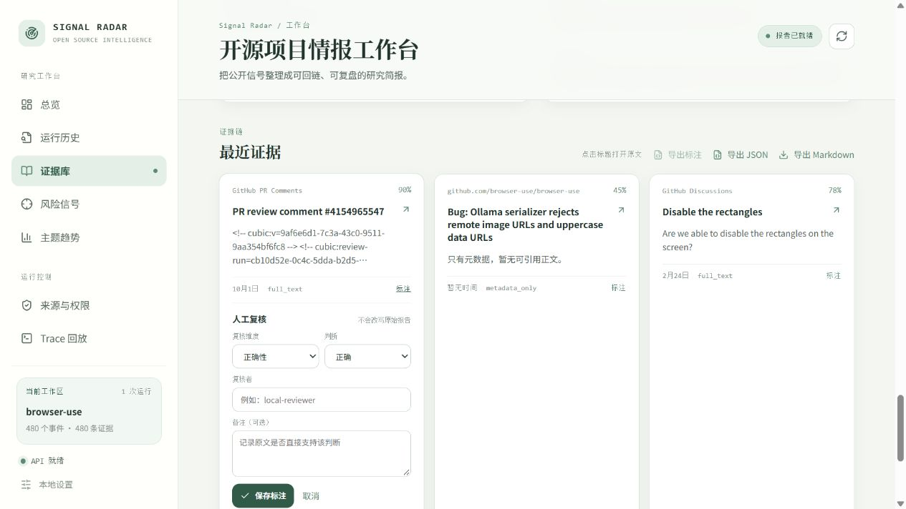

### 5. 历史、Trace 与定时监控

运行历史支持按项目或运行 ID 搜索，并按完成状态筛选；选择历史运行后可以回到报告上下文和 Trace 回放入口，按“全部 / 采集 / 完成”筛选结构化事件。设置抽屉还提供本地 Bearer Token、Browser Use 能力状态、来源参数、缓存和定时监控配置。定时监控可复用当前研究问题与来源，设置间隔、最大次数和是否立即运行，每次结果都会进入历史。

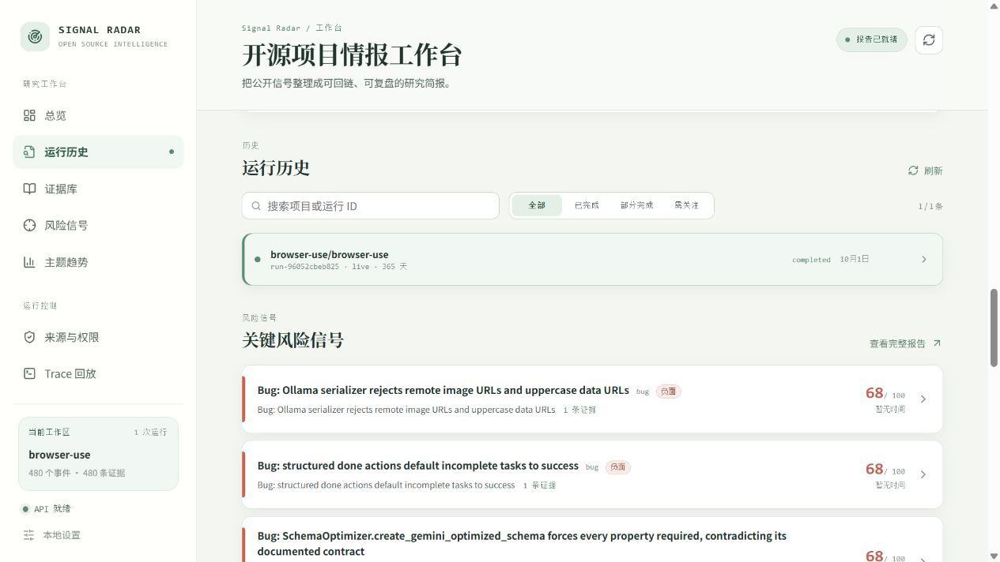

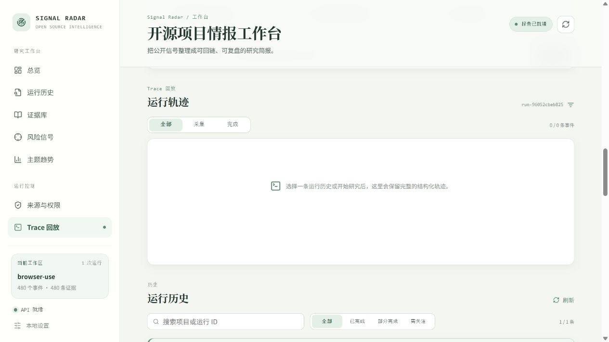

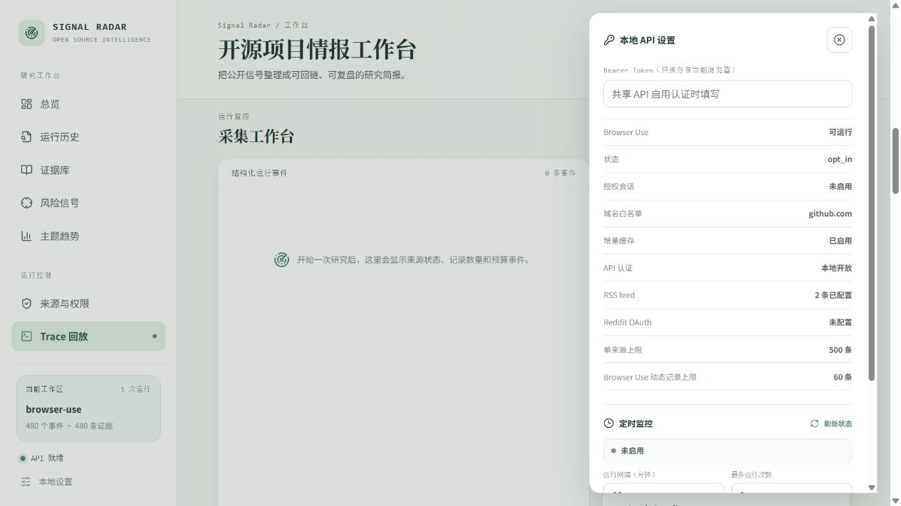

### 生命周期与功能对照

| 生命周期阶段 | 工作台入口 | 可见能力 |
| --- | --- | --- |
| 提出问题 | 总览 / 研究入口 | 自然语言解析、项目识别、时间窗口、研究主题 |
| 确认范围 | 计划预览 / 来源参数 | 来源开关、RSS/Atom URL、社区查询词、动态页面 URL、调研深度 |
| 采集 | 采集工作台 / 来源状态 | 有界并行、分页、缓存、延迟、页数、部分成功、取消和访问边界 |
| 分析 | 风险信号 / 主题趋势 | 风险信号、立场、主题聚合、时间趋势和覆盖率 |
| 复核 | 证据库 / 标注 | 原文回链、摘录、证据等级、元数据降级、人工标注和导出 |
| 归档 | 运行历史 / Trace 回放 | 历史搜索、状态筛选、报告恢复、结构化运行事件回放 |
| 持续监控 | 本地设置 / 定时监控 | Bearer Token、Browser Use 状态、缓存状态、间隔、次数、立即运行和停止 |

截图是界面证据，不替代运行契约。真实数据量、来源状态和访问边界以报告中的运行 ID、来源指标和原文链接为准。

## 核心能力

| 能力 | 当前实现 |
| --- | --- |
| 研究计划 | 规则解析项目、时间窗口、关注主题和来源，采集前确认范围 |
| 多源采集 | 结构化 API、RSS/JSON 优先，Browser Use 作为可选动态页面路径 |
| 证据报告 | 保存链接、摘录、时间、哈希和证据等级，展示事件、主题与风险信号 |
| 可观测运行 | 有界并行、预算、协作式取消、部分成功、结构化 SSE 与 Trace 回放 |
| 增量研究 | 有界分页、条件请求和记录指纹，保留缓存命中及新增/重复指标 |
| 归档与复核 | SQLite 历史、Markdown/JSON 导出、证据标注与标注集导出 |
| 定时监控 | 显式启动、限定间隔与次数、状态查询和停止，每次运行写入历史 |

## 功能状态

### 研究计划与采集

- [x] 自然语言研究计划：解析项目、时间窗口、主题和待确认来源。
- [x] 结构化只读来源：GitHub、RSS/Atom、Hacker News、Reddit、Stack Exchange。
- [x] Browser Use 动态页面：显式开关、域名白名单、步数/时间预算和本地授权 Profile。
- [ ] 更多确定性页面适配器及站点级质量基准。
- [ ] Browser Use 常驻 Worker 池和真实站点持续集成测试。

### 运行与数据

- [x] Replay 工作流：固定 fixture 离线运行，不需要模型 Key 或外部采集。
- [x] Live 工作流：有界并行、来源状态、部分成功和显式失败。
- [x] 结构化运行：后台任务、SSE 事件、来源指标和协作式取消。
- [x] 增量缓存：ETag/Last-Modified、分页、记录指纹和新增/重复统计。
- [x] Trace 与历史：SQLite 持久化、历史恢复、Trace 回放和运行筛选。
- [x] 定时监控：有界间隔、最大次数、立即运行、状态轮询和停止。
- [ ] 服务重启后自动恢复定时计划。
- [ ] 分布式任务队列与多 Worker 调度。

### 报告与复核

- [x] 报告聚合：风险信号、事件、主题、趋势、证据等级和来源访问状态。
- [x] 报告导出：持久化运行支持 Markdown/JSON，Replay 预览支持 JSON 快照。
- [x] 人工复核：证据正确性、风险等级、立场标注及 JSON 标注集导出。
- [ ] Claims / Events 的完整前端人工复核界面。

### 安全与部署

- [x] Prompt Injection fixture、metadata-only 降级和未授权动作检查。
- [x] 本地 Bearer Token、域名白名单、只读授权 Profile 和 Docker Replay。
- [ ] 多用户账号、角色权限和租户级数据隔离。

### 数据来源

| 来源 | 采集范围 | 访问条件 |
| --- | --- | --- |
| GitHub | Releases、Issues；按需 PR、Discussions、PR review comments | 公开 API，Token 可提高配额 |
| RSS / Atom | 官方博客、更新日志、技术文章 | 配置可访问的 feed |
| Hacker News | Algolia 索引中的公开帖子与评论 | 公共 API |
| Reddit | 公开帖子及可用内容 | 默认公共 JSON；403 时可配置只读 OAuth client credentials |
| Stack Exchange | 按需查询 Stack Overflow 等站点的技术问答 | 公共 API，有配额与 backoff |
| Browser Use | 用户指定的动态页面，或显式授权后的本地会话 | 可选依赖、模型 Key、双开关和域名白名单 |

来源不可访问、需要授权或仅有元数据时会保留显式状态。具体来源参数见[使用指南](docs/USAGE.md#选择数据来源)。

## 快速开始

先体验 **Replay**：运行不需要模型 Key，也不会发起外部采集。安装依赖时仍需要网络。

### 环境要求

- Python 3.11+，推荐 3.12。
- Node.js 22 与 npm，用于构建 React 工作台。
- Git，以及可写的本地项目目录。

### 1. 安装后端

```powershell
git clone https://github.com/RubiumOnly/ai-open-source-signal-radar.git
cd ai-open-source-signal-radar
python -m venv .venv
.\.venv\Scripts\Activate.ps1
python -m pip install -e ".[dev,api]"
```

<details>
<summary>macOS / Linux 的虚拟环境激活方式</summary>

```bash
source .venv/bin/activate
python -m pip install -e ".[dev,api]"
```

克隆仓库和创建虚拟环境的命令与上面相同；后续命令均在已激活的虚拟环境中执行。

</details>

### 2. 构建工作台

```sh
npm --prefix frontend ci
npm --prefix frontend run build
```

### 3. 启动并体验

```sh
python -m uvicorn signal_radar.api:app --host 127.0.0.1 --port 8000
```

打开 [http://localhost:8000](http://localhost:8000)。首页会加载固定 Replay 报告；输入研究问题、点击“解析计划”，确认来源后以 **Replay** 模式“开始研究”，即可生成一条可回放的历史运行。

```text
分析 browser-use/browser-use 最近 30 天的版本变化、安装兼容性和社区反馈
```

持久化运行支持 Markdown/JSON 报告导出；首屏 Replay 预览支持 JSON 快照。API 交互文档位于 [http://localhost:8000/docs](http://localhost:8000/docs)。

### 开发模式与 CLI

修改前端时，保留上面的 API 服务，在另一个终端运行：

```sh
npm --prefix frontend run dev
```

打开 [http://localhost:4174](http://localhost:4174)。Vite 将 `/api` 请求代理到 `127.0.0.1:8000`；前端构建产物不会自动随源码更新。

只体验命令行 Replay，无需启动 Web 服务：

```sh
python -m signal_radar --mode replay --fixture fixtures/demo_report.json
```

Docker 配置、旧版静态回退入口和故障排查见[使用指南](docs/USAGE.md)。已有 `.env` 时，服务会加载其中的配置；快速体验不要求创建或填写密钥文件。

## 启用 Live

公开 API 来源与 Browser Use 的前提不同：**GitHub、RSS 等结构化来源不需要模型 Key**；动态浏览器路径才需要模型配置。

公开 API 来源示例（每个来源最多 100 条；提高 `--limit` 可扩展到 500 条，受分页、配额和时间窗口限制）：

```sh
python -m signal_radar --mode live --project browser-use/browser-use --source github --days 30 --limit 100
```

需要动态网页时，先安装可选依赖：

```sh
python -m pip install -e ".[api,live]"
```

以 [.env.example](.env.example) 为配置模板，在未提交的本地 `.env` 中填写模型参数，并显式设置：

```dotenv
MODEL_PROVIDER=deepseek
DEEPSEEK_API_KEY=your-key
SIGNAL_RADAR_BROWSER_ENABLED=true
SIGNAL_RADAR_BROWSER_RUN_LIVE=true
SIGNAL_RADAR_BROWSER_ALLOWED_DOMAINS=github.com
ANONYMIZED_TELEMETRY=false
```

重启 API 后，再切换工作台到 **Live**。运行可能产生第三方 API/模型费用；网页授权、Chromium 环境、其他来源及预算参数见 [Live 配置](docs/USAGE.md#browser-use-动态网页)。密钥不要放入前端、URL、截图或 Git。

## 架构

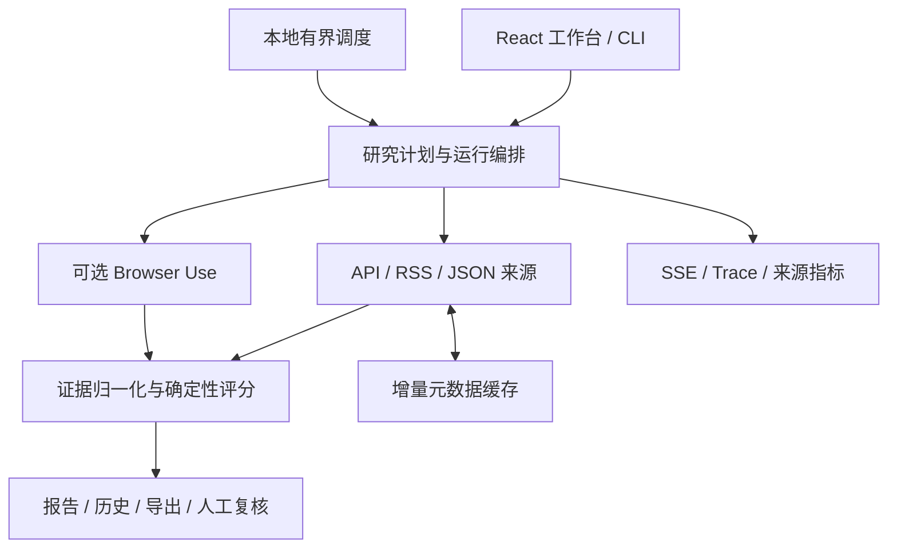

- **前端**：React 18、TypeScript、Vite、CSS design tokens、Lucide。
- **API 与契约**：FastAPI、Pydantic 2、REST 与 SSE。
- **采集与模型**：确定性来源适配器优先；Browser Use 动态抽取可使用 DeepSeek 等模型配置。
- **存储与验证**：SQLite、pytest/unittest、离线 fixture 与 GitHub Actions。

## 边界与限制

- 研究计划采用规则解析，聚合和风险评分主要采用确定性规则；不是无限制联网聊天，也不是已验证的通用 Deep Research 引擎。
- 证据可信度与风险分数是分析信号，不等于事实准确率。真实网页与模型链路的可靠性不能仅由离线测试推断。
- Browser Use 默认关闭；登录态需本地显式授权。不绕过验证码、付费墙或访问控制，网页文本不能作为任务指令。
- 调度计划保存在进程内，服务重启后不会自动恢复；SQLite 与单 Bearer Token 不提供多租户隔离。
- 默认部分只读观测接口公开。共享部署需要 Token、HTTPS、网络隔离与额外访问控制；个人浏览器 Profile 不应挂载到公共服务。

完整说明见 [SECURITY.md](SECURITY.md) 与 [API 认证边界](docs/API.md#认证)。

## 测试与文档

基础测试无需安装 Browser Use Live 依赖，也不调用真实模型或外部来源：

```sh
python -m pytest -q
python -m unittest discover -s tests -q
python -m compileall -q signal_radar tests
npm --prefix frontend run build
```

| 文档 | 内容 |
| --- | --- |
| [使用指南](docs/USAGE.md) | 来源、缓存、Browser Use、定时监控、部署与故障排查 |
| [API 参考](docs/API.md) | 端点、认证、运行与报告契约、复核示例 |
| [离线评测](docs/EVALUATION.md) | 评测命令、基准、安全门禁及解释范围 |
| [配置模板](.env.example) | 模型、来源、预算、存储与认证环境变量 |
| [贡献指南](CONTRIBUTING.md) | 开发验证与数据源约定 |
| [更新记录](CHANGELOG.md) | 功能与修复历史 |

## 贡献与许可证

欢迎通过 [Issues](https://github.com/RubiumOnly/ai-open-source-signal-radar/issues) 提交可复现问题或来源适配建议；提交代码前请阅读[贡献指南](CONTRIBUTING.md)。安全问题按[安全说明](SECURITY.md)私下报告，不要公开凭据或可利用细节。

本项目采用 [MIT License](LICENSE)。浏览器 Agent 依赖 [browser-use](https://github.com/browser-use/browser-use)，第三方依赖与数据来源仍受各自许可证和服务条款约束。
