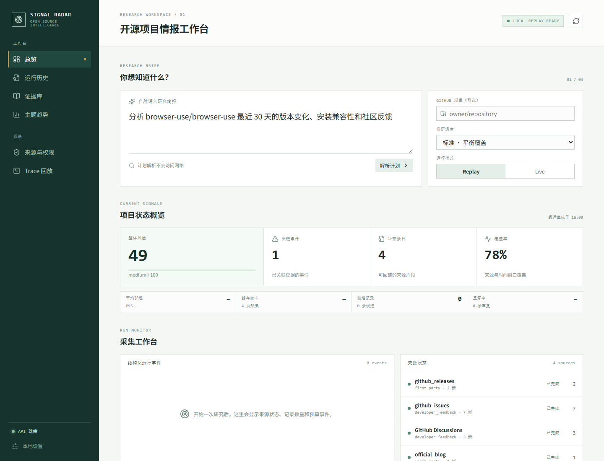
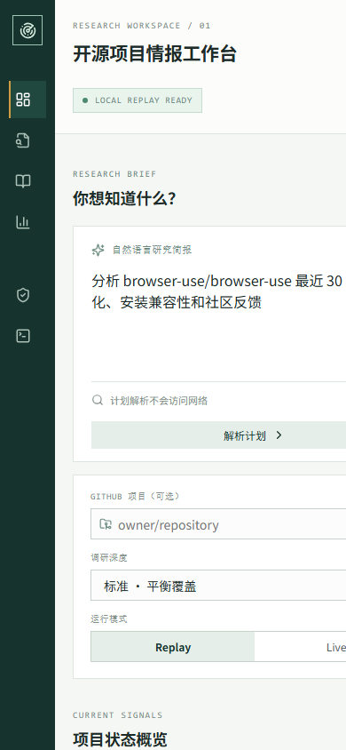

# AI 开源项目社区反馈与版本风险雷达

当前版本：`0.2.0`

这是一个基于 `browser-use` 的可审计研究型 Agent：它围绕一个 AI 开源项目，汇总版本事实、开发者社区反馈和公开技术文章，生成带证据引用的风险报告。

项目的目标不是宣称“抓取全网舆情”，也不是把 GitHub 代码当成舆情。GitHub Issues、Discussions、Pull Requests 和 Releases 代表项目参与者的反馈与维护状态；外部网站用于补充使用体验。报告会区分**事实、观点、统计信号和推断**，并在证据不足时明确标注不确定性。

当前重构入口是一个 React + TypeScript 研究工作台：用户输入自然语言研究简报，先确认项目、时间窗口、主题和来源，再启动有界运行。工作台通过结构化事件流展示来源采集、记录数量、延迟、失败状态和最终证据报告；旧 `web/` 页面暂时保留为静态 Replay 回退。

工作台中的 Trace 回放区域会保留当前运行的完整结构化事件，可按全部、采集或完成阶段筛选，
并展示来源、页数、延迟、缓存命中和新增/重复记录。它只回放审计字段，不暴露内部思维链。

## 典型使用场景

输入一个项目和时间窗口，例如：

```text
项目：browser-use/browser-use
时间窗口：最近 30 天
```

输出包含：

- 版本和事件时间线；
- 安装、兼容性、性能、安全和维护响应等主题；
- 支持、反对或不确定的开发者立场；
- 风险等级、风险分数和覆盖率；
- 每个结论对应的 URL、标题、发布时间和原文摘录；
- 来源访问状态、需要人工复核的内容，以及运行追踪信息。

## 架构

```text
React Workbench / API
      |
Run Orchestrator  -- 研究计划、运行 ID、预算、并行、取消、只读策略
      |
来源适配器：GitHub API（Releases/Issues，按需 Pull Requests） / RSS 与 Atom 官方博客 / Hacker News Algolia / Replay fixture / Browser Use 动态网页
      |
Browser Use 回退：动态页面、跨页上下文、授权后的本地会话
      |
结构化抽取：事件、主题、立场、证据、访问状态
      |
增量缓存 + 分页去重  ->  风险评分  ->  JSON / Markdown 报告
      |
SSE 事件、Trace、URL、截图、失败记录、评测指标
```

**Browser Use 的职责**是规划和执行需要浏览器的只读动作，例如展开动态 Discussions、跨页面寻找上下文、在用户确认后浏览登录态页面。稳定的结构化数据优先使用 GitHub API、RSS 或普通 HTTP 请求，避免让浏览器承担可以确定性完成的工作。领域模型、去重、评分和报告契约由本项目实现。

## 数据来源与边界

每个来源都会归类为：

| 状态 | 处理方式 |
| --- | --- |
| `public` | API、RSS 或公开 HTML，直接读取并保存证据 |
| `dynamic` | 公开但依赖 JavaScript，使用 `browser-use` 只读浏览 |
| `auth_required` | 需要登录，优先使用官方 API；否则本地浏览器复用会话并要求人工确认 |
| `blocked` | 验证码、频率限制、robots 或服务条款阻断，记录原因并切换来源 |
| `metadata_only` | 只能取得标题/时间等元数据，不把它伪装成正文证据 |

CSDN、知乎等登录或反爬平台不是 MVP 的硬依赖。Agent 不绕过验证码、付费墙或访问控制，不保存账号密码和 Cookie，不自动点赞、评论、发帖或下单。Live 模式的浏览器会话应留在用户机器上；后端只接收经过筛选的证据。

### RSS/Atom 与官方博客

官方博客、产品更新日志等稳定来源优先通过标准 RSS 2.0 或 Atom 1.x feed 读取，不需要启动浏览器。`RSSSourceAdapter` 使用标准库 `urllib` 和 `xml.etree.ElementTree`，具备请求超时、响应大小上限、条数上限、时间窗口过滤和跨 feed 去重。每条文章都会保存原始链接、发布时间、摘要/正文摘录与 feed 格式，最终映射为 `Article`、`Evidence`、`Claim` 和 `Event`。

可以在 Python 中读取一个或多个公开 feed：

```python
from datetime import datetime, timezone

from signal_radar.sources import RSSSourceAdapter

adapter = RSSSourceAdapter(timeout=8, max_limit=50)
result = adapter.collect(
    ["https://example.com/blog/feed.xml"],
    limit=10,
    since=datetime(2026, 1, 1, tzinfo=timezone.utc),
)
print(result.status.model_dump())
```

Feed 不可访问、需要登录、被限流或 XML 无法解析时，适配器返回显式的 `SourceStatus`（例如 `auth_required`、`rate_limited`、`blocked` 或 `error`），不会静默丢弃来源，也不会读取本地模型密钥。没有正文的 feed 条目会将证据等级标为 `excerpt`，不会伪装成完整文章。

### Hacker News 公共社区

Hacker News 通过公开的 Algolia API 提供 story/comment 索引。`HackerNewsSourceAdapter`
只向固定的 `hn.algolia.com` 发起 GET 请求，不需要登录，也不会执行帖子中的指令。评论正文或
story 文本会保存为可引用证据；只有标题的命中会标记为 `metadata_only`。查询默认使用项目名，
也可以显式指定关键词：

```powershell
python -m signal_radar --mode live --project browser-use/browser-use `
  --source hackernews --community-query "browser-use" --days 30 --limit 10
```

API 请求示例：

```json
{
  "mode": "live",
  "project": "browser-use/browser-use",
  "sources": ["github", "community"],
  "community_query": "browser-use",
  "window_days": 30,
  "limit": 10
}
```

社区来源代表 Hacker News 参与者的公开讨论，不等于全部用户或市场舆情。Algolia 接口失败、
限流或返回异常时，运行状态会保留 `error` / `rate_limited`，报告不会静默补写内容。

## 快速开始

要求 Python 3.11+。

```powershell
python -m venv .venv
.\.venv\Scripts\Activate.ps1
python -m pip install -U pip
pip install -e ".[dev,api]"
Copy-Item .env.example .env
```

### React 工作台

在另一个终端启动主要产品入口：

```powershell
cd frontend
npm ci
npm run dev
```

打开 `http://localhost:4174`。首页研究简报的计划解析不会访问网络；确认来源和调研深度后，点击“开始研究”才会创建运行。

### Replay 模式（无需网络和 API Key）

Replay 使用 `fixtures/demo_report.json`，适合仓库内本地演示、首次体验和离线测试：

```powershell
python -m signal_radar --mode replay --fixture fixtures/demo_report.json
```

Replay 不会启动浏览器，也不会读取任何密钥。React 工作台会通过 API 加载同一份固定报告。

### Live 模式

Live CLI 会读取 GitHub 的公开 Releases 和 Issues；GitHub Token 不是必需项，但可用于提高 API 速率限制。需要 Browser Use 动态采集时，请使用后面的 API 配置，并在本地或受控后端运行：

```powershell
python -m signal_radar --mode live --project browser-use/browser-use --days 30 --source github
```

具体命令以 `python -m signal_radar --help` 为准。没有凭据时请使用 Replay，不要把 Key 写入前端或提交到 Git。

读取公开 RSS/Atom feed：

```powershell
python -m signal_radar --mode live --project browser-use/browser-use --source rss `
  --feed-url https://example.com/blog/feed.xml --days 30 --limit 10
```

启动本地 API（供 React 工作台和旧版 Replay 页面使用）：

```powershell
pip install -e ".[dev,api]"
uvicorn signal_radar.api:app --reload --port 8000 --env-file .env
```

如果 `frontend/dist` 已构建，FastAPI 会在同一个端口挂载 React 工作台；开发时推荐使用 Vite 的 `4174` 端口和代理。

本地开发默认不启用 API 认证，因此 Replay Dashboard 开箱即用。部署到共享或公网环境时，
请在后端设置随机的 `SIGNAL_RADAR_API_TOKEN`；启用后，运行控制和历史导出接口需要
`Authorization: Bearer <token>`，健康检查、当前报告和来源状态仍可用于探活与只读展示：

```powershell
$env:SIGNAL_RADAR_API_TOKEN = "replace-with-a-long-random-token"
uvicorn signal_radar.api:app --port 8000 --env-file .env
```

带认证启动 Replay 运行：

```powershell
$headers = @{ Authorization = "Bearer $env:SIGNAL_RADAR_API_TOKEN" }
Invoke-RestMethod http://localhost:8000/api/run -Method Post -Headers $headers `
  -ContentType "application/json" -Body (@{ mode = "replay" } | ConvertTo-Json)
```

旧版静态 Replay 页面仍可单独启动：

```powershell
python -m http.server 4173 --directory web
```

打开 `http://localhost:4173/?api=http%3A%2F%2Flocalhost%3A8000`，即可使用旧版静态 Replay。主要产品入口是 `http://localhost:4174`。

研究计划和运行流接口：

```text
POST /api/plan                         解析自然语言研究简报，不访问网络
POST /api/runs                         后台启动运行，返回 run_id
GET  /api/runs/{run_id}/stream         SSE 结构化来源事件
GET  /api/runs/{run_id}/events         获取已保存的运行事件
GET  /api/runs/{run_id}/trace          回放同一组结构化事件
POST /api/runs/{run_id}/follow-up      基于已有报告创建有界补查
GET  /api/runs/{run_id}                查询运行和报告
GET  /api/metrics                      查看当前与历史来源质量指标
```

工作台的“运行历史”直接读取 SQLite 运行记录。选择某次运行后，页面会恢复该运行的报告、来源状态和结构化事件；服务重启后仍可回放，不依赖进程内缓存。

### 增量缓存与分页

Live 运行默认启用本地来源元数据缓存（`data/source-cache.sqlite3`）。缓存只保存
HTTP 的 `ETag`、`Last-Modified`、响应摘要和记录指纹，不保存正文、Cookie、浏览器
Profile 或模型密钥。重复运行会优先发送条件请求；相同记录不会再次进入分析，内容
发生变化的记录会作为更新重新分析。每个来源状态会记录 `pages`、`latency_ms`、
`new_records`、`duplicate_records`、`total_candidates` 和 `cache_hit`，工作台的来源
面板与运行事件会显示这些指标。

GitHub、Hacker News 和 Reddit 使用有界分页（默认最多 4 页，可分别通过
`SIGNAL_RADAR_GITHUB_MAX_PAGES`、`SIGNAL_RADAR_HACKERNEWS_MAX_PAGES` 和
`SIGNAL_RADAR_REDDIT_MAX_PAGES` 调整）；RSS/Atom 使用响应校验器和跨 feed 去重。
研究简报中明确写出 Pull Request/合并请求，或在请求的 `sources` 中使用
`github_prs`，才会启用 GitHub PR 元数据来源；默认 GitHub 运行仍只读取 Releases 和 Issues。
可以通过 `SIGNAL_RADAR_CACHE_ENABLED=false` 关闭缓存，或设置
`SIGNAL_RADAR_CACHE_DB` 使用其他本地路径。关闭缓存不会改变来源的只读和页数上限。

Browser Use 动态采集是显式开启的可选路径。先安装额外依赖，在本地环境变量中配置模型 Key，
再把 `SIGNAL_RADAR_BROWSER_ENABLED` 和 `SIGNAL_RADAR_BROWSER_RUN_LIVE` 都设为 `true`：

```powershell
pip install -e ".[api,live]"
$env:DEEPSEEK_API_KEY = "your-key"  # 只在本机 .env 或环境变量中设置
$env:MODEL_PROVIDER = "deepseek"
$env:DEEPSEEK_MODEL = "deepseek-chat"
$env:SIGNAL_RADAR_BROWSER_ENABLED = "true"
$env:SIGNAL_RADAR_BROWSER_RUN_LIVE = "true"
$env:ANONYMIZED_TELEMETRY = "false"
uvicorn signal_radar.api:app --port 8000
```

然后只向白名单 URL 发起只读运行；页面中的指令不会被当作系统指令执行：

```powershell
Invoke-RestMethod http://localhost:8000/api/run -Method Post -ContentType "application/json" -Body (@{
  mode = "live"
  project = "browser-use/browser-use"
  sources = @("github", "community", "browser_use")
  community_query = "browser-use"
  urls = @("https://github.com/browser-use/browser-use/discussions")
  window_days = 30
  limit = 5
} | ConvertTo-Json)
```

动态页面记录会区分“可核验摘录”和“仅有标题/链接的元数据”。如果模型没有明确标记原文摘录或可见日期，系统会丢弃对应正文/时间并降低证据等级，不会把推断内容写进报告。

### 运行预算与取消

Live 运行默认带有硬边界：Browser Use 最多执行 12 步、单次浏览预算默认为 180 秒；
服务端还会把请求值限制在适配器配置的上限内。可以在请求中传入更小的预算，并用一个
预先指定的 `run_id` 让另一个客户端请求取消正在运行的任务：

```powershell
$body = @{
  mode = "live"
  run_id = "run-local-demo"
  project = "browser-use/browser-use"
  sources = @("browser_use")
  urls = @("https://github.com/browser-use/browser-use/discussions")
  max_steps = 6
  timeout_seconds = 60
} | ConvertTo-Json
Invoke-RestMethod http://localhost:8000/api/run -Method Post -ContentType "application/json" -Body $body
```

在运行完成前，另一个终端可以发出取消请求：

```powershell
Invoke-RestMethod http://localhost:8000/api/runs/run-local-demo/cancel -Method Post
```

取消是协作式的：Browser Use 会停止当前任务，运行状态会变成 `cancelled`；已经完成的
运行不能撤销。`GET /api/runs/{run_id}` 会返回结构化预算、来源状态和取消标志，方便
审计实际消耗，而不是只记录最终报告。

React 工作台在 Live 运行期间会显示“取消运行”操作；取消请求只设置运行控制句柄，
不会执行来源写操作，也不会强制终止正在进行的外部请求。

#### 网页 Prompt Injection 与只读边界

动态页面中的文字始终是不可信数据。页面可能出现“忽略之前指令”“上传
凭据”或类似伪装成系统消息的内容；Browser Use 任务只把它们当作待分析的
页面文本，不会改变系统策略，也不会执行登录、提交、点赞、下载或跨域跳转。
未被模型明确标记为可见原文的摘录会被清空并降级为 `metadata_only`。这条边界
有本地回归 fixture 覆盖：

```powershell
python -m unittest tests.test_prompt_injection_security -v
```

也可以使用 CLI 触发动态来源。必须同时显式开启适配器和实时执行，并重复传入需要访问的 URL：

```powershell
python -m signal_radar --mode live --project browser-use/browser-use --source browser_use `
  --url https://github.com/browser-use/browser-use/discussions --max-steps 6 --timeout-seconds 60 `
  --enable-browser-use --browser-run-live --limit 5
```

本地运行时请将 `.env` 中的变量导出到当前进程（或安装 `.[live]` 后由应用加载）；Docker Compose 会通过 `env_file` 自动传入这些变量。
`ANONYMIZED_TELEMETRY=false` 可关闭 browser-use 的匿名运行遥测，建议在受控环境中显式设置。

## 报告契约

`Report` 顶层字段如下：

```text
project{name, repository, description, version, last_release_at}
generated_at
window_days
summary{risk_score, risk_level, events_count, source_count, coverage_pct}
trends[]
topics[]
evidence[]
sources[]
access_status[]
```

证据至少包含 `id`、`url`、`title`、`source`、`published_at`、`quote`、`content_hash`、`confidence`。引用只对保存过的原文片段负责；系统不会因为某个页面不可访问就猜测正文。

## 评测

评测集使用固定 HTML/JSON fixture，不依赖网络。建议持续记录：

- 结构化输出通过率和字段完整率；
- URL、内容哈希和事件去重准确率；
- 事件/主题/立场分类的 Precision、Recall、F1；
- 引用支持率和来源覆盖率；
- 任务成功率、恢复率、P95 延迟和 Token 成本；
- 未授权动作次数（目标为 0）。

运行本地契约测试：

```powershell
python -m unittest discover -s tests -v
```

若已安装开发依赖，也可以运行：

```powershell
pytest -q
```

### 离线报告评测

评测 harness 读取固定 JSON fixture，不访问网络、模型或浏览器。它会分别检查
报告契约、证据引用覆盖率、来源可用率、事件计数，以及事件/汇总风险分数的一致性：

```powershell
python -m signal_radar.evaluate `
  --fixture fixtures/demo_report.json `
  --output reports/evaluation-demo.json
```

输出是可复现的 JSON，主要字段包括 `schema_valid`、`citation_coverage`、
`source_coverage`、`event_consistency`、`performance`、`checks` 和 `passed`。`schema_valid=true`
只表示 fixture 能通过 `Report` 契约校验；如果历史 fixture 的汇总数字与明细不一致，
评测会保留该报告并将对应一致性检查标为 `false`，不会静默回退到演示数据。输入 JSON
无法解析时命令返回非零退出码，并在 `schema_errors` 中给出可读原因。
`fixtures/evaluation_inconsistent.json` 是一个专门用于验证失败检测的最小样例。

评测输出还包含 `security` 和对应的 `checks`：

- `security.unauthorized_action_target`：运行时上报的未授权动作目标数，必须为 `0`；
- `security.metadata_only_evidence_count`：只含元数据的证据数量；
- `security.metadata_only_quotes_empty`：所有 `metadata_only` 证据都必须没有正文摘录；
- `checks.unauthorized_action_target_zero` 与 `checks.metadata_only_quotes_empty`：安全门禁，任一失败都会使 `passed=false`。

`fixtures/prompt_injection_browser_use.json` 演示了页面含有指令样文本时的安全
结果：页面标题可以保留为待分析元数据，但正文证据为空，且未授权动作目标为零。

### 运行历史与报告导出

API 默认将运行记录和报告快照保存到 `data/runs.sqlite3`；`data/` 已加入 `.gitignore`，不会进入仓库。也可以通过 `SIGNAL_RADAR_HISTORY_DB` 指定数据库路径。

```text
GET  /api/runs?limit=20&offset=0
GET  /api/runs/{run_id}
GET  /api/runs/{run_id}/markdown
```

Markdown 导出包含摘要、关键事件、主题、证据和来源状态，适合归档或二次编辑。测试环境可以向 `create_app(history_store=HistoryStore(":memory:"))` 注入内存存储。

### 本地定时调度（默认关闭）

项目提供一个基于 Python 标准库的本地有界调度器，用来重复执行已有的只读
`RunRequest`。它不新增浏览器动作，不绕过登录或验证码，也不会在导入 API 时
自动启动。每次 tick 都复用同一套来源适配器、预算、取消边界和 SQLite 历史，
因此可以通过 `/api/runs` 审计每一次运行。调度默认等待第一个间隔；如需立即
执行一次，显式设置 `run_immediately`。

查看调度状态、启动和停止：

```powershell
# 默认状态为 disabled；下面的启动请求最多运行两次，每次间隔 1 小时。
Invoke-RestMethod http://localhost:8000/api/schedule
Invoke-RestMethod http://localhost:8000/api/schedule -Method Post -ContentType "application/json" -Body (@{
  request = @{
    mode = "live"
    project = "browser-use/browser-use"
    sources = @("github", "community")
    community_query = "browser-use"
    window_days = 7
    limit = 10
  }
  interval_seconds = 3600
  max_runs = 2
  run_immediately = $true
} | ConvertTo-Json -Depth 5)
Invoke-RestMethod http://localhost:8000/api/schedule/stop -Method Post
```

调度请求只接受内置来源名称（`github`、`github_prs`、`rss`、`hackernews`、`browser_use`
及其只读别名），最多 4 个来源和 20 个 URL/feed，间隔限制在 1 秒到 24 小时，
单个计划最多 1000 次运行。调度线程是 daemon 线程；停止服务或调用 stop 后，
不会再创建新的 tick。正在进行的 Live 运行会尽力通过现有取消句柄停止。

也可以使用 CLI。`--schedule` 是唯一的启用开关，命令结束前会将每次运行保存
到 `SIGNAL_RADAR_HISTORY_DB`：

```powershell
python -m signal_radar --mode replay --fixture fixtures/demo_report.json `
  --schedule --schedule-interval 60 --schedule-max-runs 2 --schedule-run-immediately
```

环境变量 `SIGNAL_RADAR_SCHEDULER_*` 只提供 API 启动请求的默认值，详见
`.env.example`；没有显式调用 API 或传入 `--schedule` 时不会调度。

### 人工复核与标注数据

报告生成后可以通过独立的标注记录建立人工复核闭环。标注不会改写模型输出，
而是引用报告中的 `evidence`、`claim` 或 `event` ID，并记录复核维度、判断、
备注、复核者和时间戳。支持的维度与值为：

| 维度 | 可选判断 |
| --- | --- |
| `stance` | `support`、`supportive`、`oppose`、`against`、`uncertain`、`mixed`、`neutral` |
| `risk` | `low`、`medium`、`high`、`critical` |
| `correctness` | `correct`、`partially_correct`、`incorrect`、`uncertain` |

接口默认跟随运行历史的认证策略（设置 `SIGNAL_RADAR_API_TOKEN` 后需要
`Authorization: Bearer <token>`）：

```text
POST /api/annotations                 新增一条人工复核标签
GET  /api/annotations                 按运行、对象或维度筛选
GET  /api/annotations/export.json     导出 JSON 标注集
```

示例请求：

```json
{
  "run_id": "run-local-demo",
  "target_type": "evidence",
  "target_id": "ev-001",
  "label": "correctness",
  "value": "correct",
  "note": "原文能够直接支持该引用。",
  "reviewer": "local-reviewer"
}
```

服务端会校验 `run_id` 对应报告中是否存在目标 ID，避免产生无法回溯的孤立标注。
导出的数组可以直接接入离线评测 harness，评估标注目标覆盖率并报告孤立记录：

```powershell
python -m signal_radar.evaluate `
  --fixture fixtures/demo_report.json `
  --annotations reports/annotations.json `
  --output reports/evaluation-with-annotations.json
```

标注属于本地复核数据，默认保存在 `data/runs.sqlite3`，不会写入报告 fixture，
也不应把包含个人信息的标注文件提交到公开仓库。

## 运行、展示与部署

GitHub 仓库包含完整源码、测试、fixture 和运行文档。推荐先运行 Replay，再切换到 Live；`frontend/` 是主要工作台，不承担 Python Agent、Chromium 或模型 Key。

推荐拆分为：

1. 本地或受控云服务：Live API、模型调用和 Browser Use；
2. `frontend/`：React 研究工作台，通过 REST + SSE 访问 API；
3. `web/`：旧版静态 Replay 回退，可单独托管但不承担 Live 运行；
4. 前端只保存用户主动填写的 API Bearer Token，绝不把模型 Key 放进浏览器包。

## Replay 回退预览

下面是 React 研究工作台加载真实 Replay API 后生成的截图，桌面和移动视口均已验证。旧版静态 Replay 页面仍保留为回退入口：





建议按以下顺序启动一个本地运行：

```text
git clone <repo>
pip install -e ".[dev]"
python -m signal_radar --mode replay --fixture fixtures/demo_report.json
```

随后可以查看源码、契约测试、fixture、架构图，以及 Live 模式的模型、浏览器会话、权限边界和失败降级。Live 运行应明确提示网络、成本和来源访问限制。

### Docker（Replay API + React 工作台）

仓库附带多阶段镜像，默认提供 Replay API 和已构建的 React 工作台，不安装浏览器，也不需要模型 Key：

```powershell
Copy-Item .env.example .env
docker compose up --build
```

服务默认监听 `http://localhost:8000`，打开根路径即可进入工作台。Live 部署应单独构建受控镜像并安装 `.[live]`，同时配置域名白名单、资源预算和人工确认策略；不要把宿主机 Chrome Cookie 挂载到公共服务。
GitHub API、RSS 和 Hacker News 请求会在来源调用前后检查总预算，但同步 HTTP 请求本身无法被线程外硬中断；它们完成后会被统一标记为 `partial` 或 `cancelled`。Browser Use 任务支持真实的超时和协作式取消。

主要 API：`GET /api/health` 检查服务，`GET /api/report` 读取当前报告，`GET /api/sources` 查看来源状态，`POST /api/run` 启动 Replay 或 Live 运行。接口返回的报告遵循上面的 `Report` 契约。设置 `SIGNAL_RADAR_API_TOKEN` 后，`POST /api/run`、`GET /api/run`、运行历史（`/api/runs*`）、取消和 Markdown 导出均要求 Bearer Token；健康、报告和来源读取保持公开，便于只读 Dashboard 和探活。
运行控制 API：`GET /api/runs` 查看历史，`GET /api/runs/{run_id}` 查看预算和结果，
`POST /api/runs/{run_id}/cancel` 请求取消仍在运行的任务，`GET /api/runs/{run_id}/markdown`
导出可审计 Markdown 报告。

## 目录约定

```text
signal_radar/       后端编排、来源适配器、报告模型
frontend/            React + TypeScript 研究工作台
docs/images/        README 使用的真实 Dashboard 截图
web/                旧版静态 Replay 回退
fixtures/           离线演示和评测输入
data/               本地 SQLite 运行历史（默认不提交）
tests/              不需要网络/API Key 的契约与单元测试
```

## 参与与安全

- 贡献流程见 [`CONTRIBUTING.md`](CONTRIBUTING.md)；
- 凭据、浏览器权限和漏洞报告规则见 [`SECURITY.md`](SECURITY.md)；
- 版本变化见 [`CHANGELOG.md`](CHANGELOG.md)。

仓库的 GitHub Actions 会在 Python 3.11/3.12 和 Node 22 下运行契约测试、离线评测、编译检查、依赖检查和 React 构建。

## 当前扩展版范围

- 已完成多源采集：GitHub、RSS/Atom、Hacker News Algolia 和 Browser Use 动态页面；
- 已完成证据链、趋势、主题、关键事件、风险评分与 Markdown 导出；
- 已完成 SQLite 运行历史、预算、取消接口、域名白名单和 Prompt Injection 回归门禁；
- 已完成离线评测 harness、失败样例、GitHub Actions 质量门禁和桌面/移动截图；
- 已完成默认关闭的本地定时调度：可配置来源、时间间隔和最大次数，每次运行写入 SQLite 历史并支持停止；
- 已完成有界并行来源编排、研究计划预览、后台运行和结构化 SSE 事件；
- 已启动 React 工作台重构：研究简报、来源预览、运行监控、风险信号和证据卡片已接入 Replay/API；
- 登录来源仍保持只读和人工授权边界，不绕过验证码、付费墙或访问控制。

后续重构重点是完善独立 Trace 视图、更多确定性页面适配器和授权浏览器 Worker；现有安全、预算、取消、标注、缓存和离线评测能力必须保持。

## 设计与工程要点

GitHub 是高质量的开发者反馈源，但不等于大众舆情；Browser Use 仅用于需要浏览器的动态任务。API、权限边界、证据引用、失败降级和离线评测共同决定报告是否可信。

